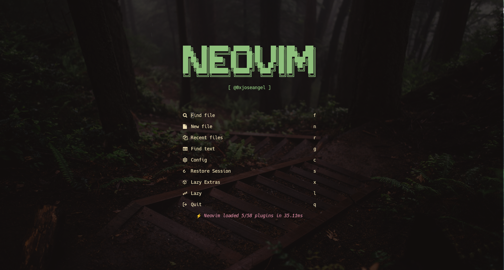
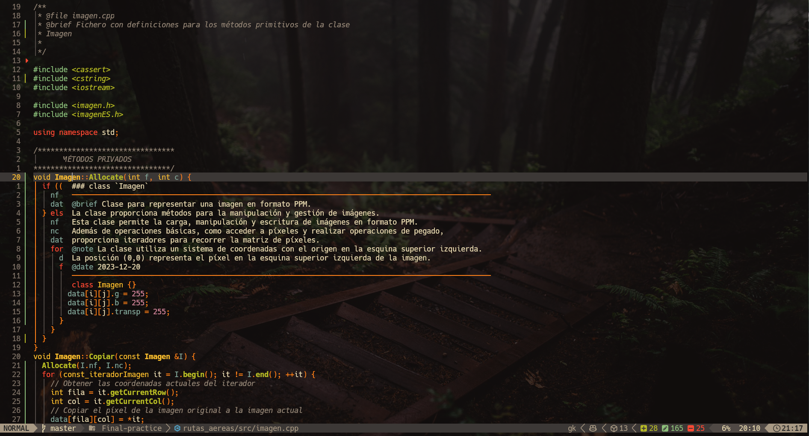
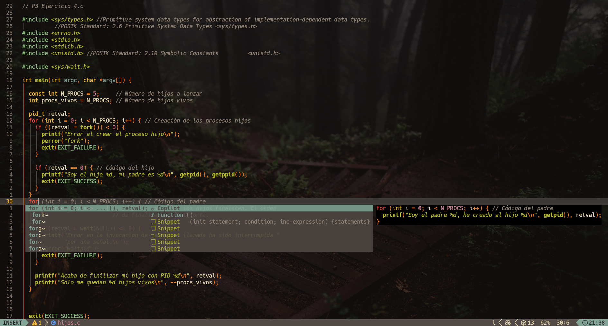
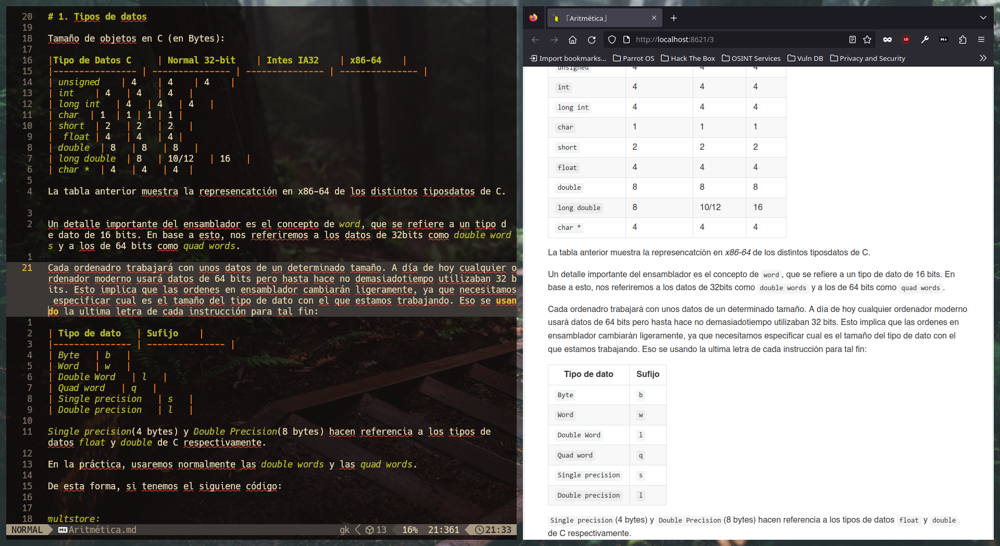

# Neovim

Este repositorio contiene mi configuración personalizada para Neovim, optimizada para facilitar el desarrollo y mejorar la productividad. La configuración incluye el uso de lazy loading para cargar plugins de manera eficiente. Siéntete libre de explorar, clonar y adaptar según tus preferencias.

## Instalación
```
git clone https://github.com/0xjoseangel/nvim-config.git ~/.config/nvim
```
Si ahora abres nvim, debería de cargarse la configuración automaticamente.
## Características destacadas
- Lazy Loaded: La configuración incluye la carga diferida de plugins para mejorar los tiempos de inicio.- 
- Tema: Se utiliza el tema  con una configuración transparente para una experiencia visual agradable.
- Atajos de teclado: Se han definido atajos personalizados para agilizar las tareas comunes. Se ha usado la configuración de LAZYVIM, por lo que puedes verlos en https://www.lazyvim.org/. 
- Soporte para Varios Lenguajes: La configuración está preparada para programar en c/c++ o python con soporte completo para Language Server Protocol (LSP), resaltado de sintaxis, depuradores, formateadores, entre otros. Si deseas añadir más lenguajes, puedes seguir la documentaciónde LazyVim.

- Copilot: Se ha integrado con Copilot, una herramienta de GitHub que utiliza inteligencia artificial para ayudar a los desarrolladores a escribir código. La integración se ha realizado a través de un plugin que permite utilizar Copilot desde Neovim.

- Markdown y LaTeX: También está pensada para tomar apuntes con Markdown, ya que cuenta con diversos plugins para escribir y visualizar este tipo de archivos. Además, se integra con LaTeX para aquellos que prefieren la escritura académica con este sistema.

## Estructura del Repositorio
```
.
├── init.lua
├── lazy-lock.json
├── lazyvim.json
├── LICENSE
├── lua
│   ├── config
│   │   ├── autocmds.lua
│   │   ├── keymaps.lua
│   │   ├── lazy.lua
│   │   └── options.lua
│   └── plugins
│       ├── colorscheme.lua
│       ├── example.lua
│       ├── logo.lua
│       ├── markdown.lua
│       └── notify.lua
├── README.md
└── stylua.toml
```
Para familiarizarte con la edición de plugins, puedes cambiar el logo de la pantalla principal accediendo al fichero `lua/config/plugins/logo.lua`.
> [!TIP]
> Si quieres modificar los plugins existentes o añadir nuevos puedes visitar https://www.lazyvim.org/.
